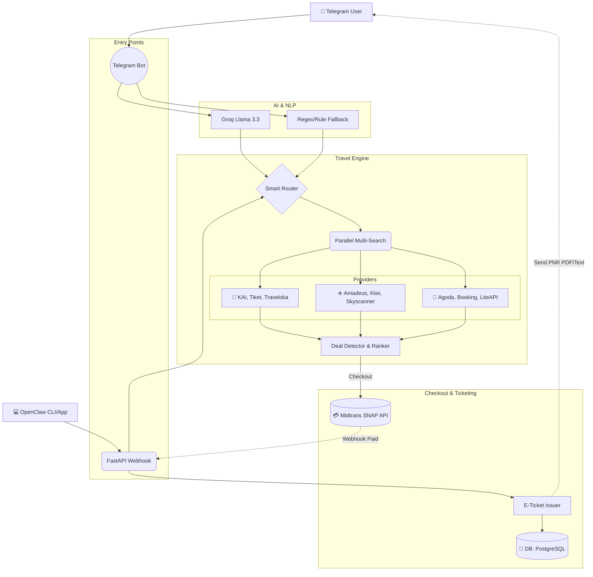

<div align="center">
  
  <h1>OpenClaw Travel Agent v4</h1>
  <p><b>Super-Powered Autonomous AI Travel Assistant for Indonesia 🇮🇩</b></p>
  
  [](https://www.python.org)
  [](https://fastapi.tiangolo.com)
  [](https://midtrans.com)
  [](https://opensource.org/licenses/MIT)

  <p>
    An intelligent multi-platform agent that searches <b>Trains, Flights, and Hotels</b> simultaneously across multiple popular Indonesian providers (KAI, Tiket, Traveloka, Agoda, Booking.com, etc.), finds the absolute cheapest deals, and executes live transactions instantly.
  </p>
</div>

---

## ⚡ Core Features

- 🧠 **Groq Llama-3.3 Powered Intent Engine**: Understands messy natural Indonesian language (*"Cariin tiket sby-jkt bsk pagi donk yg murah"*).
- ✈️ **Multi-Concurrent Aggregator**: Hits KAI, Traveloka, Skyscanner, Agoda, and more simultaneously using API clients and Playwright fallback scrapers.
- 💳 **Live Midtrans Payments**: End-to-End dynamic checkout via **QRIS, GoPay, dan Virtual Account** directly inside Telegram chat. Includes scannable QR Barcodes for PC users.
- 🎟 **E-Ticket Dispatcher**: Auto-generates PNRs and sends beautiful E-Tickets via Telegram the second a payment clears the bank webhook.
- 🛡 **Battle-Tested Infrastructure**: Features PostgreSQL connection pooling, `systemd` dual-core Daemon (API + Bot runtime), memory leak guards, and network timeout resistance for 24/7 uptime.

---

## 🏗 Architecture Blueprint

The system consists of two main gateways (Telegram & Native OpenClaw), an Intelligent AI Router, a Concurrent Scraping Engine, and a Secure Payment Pipeline.



---

## 🚀 Quick Start (Docker - Recommended)

```bash
# 1. Clone & enter repository
git clone https://github.com/Timcuan/openclaw-travel-agent.git
cd openclaw-travel-agent

# 2. Setup environment variables
cp .env.example .env

# 3. Edit .env with your keys (Groq, Telegram, Midtrans)
nano .env

# 4. Bring up the Database, Redis, Telegram Bot, and FastAPI Server
docker-compose up --build -d
```

> **Untuk Pengguna OpenClaw Framework**: Jalankan `bash scripts/install_skill.sh` untuk mendaftarkan agensi ini sebagai _Skill Native_ di mesin lokal Anda yang bisa dipanggil dari UI/CLI utama OpenClaw.

---

## 🛡️ Live Deployment (Linux VPS/Debian)

To deploy the bot as a highly-available standard background service:

1. **Persiapkan Script Dual-Core Start:**
   ```bash
   chmod +x scripts/start_prod.sh
   ```
2. **Pasang Systemd Daemon:**
   ```bash
   sudo cp deploy/openclaw-travel-agent.service /etc/systemd/system/
   sudo systemctl daemon-reload
   sudo systemctl enable --now openclaw-travel-agent
   sudo systemctl status openclaw-travel-agent
   ```
   *Note: Pastikan Anda menyesuaikan path `/opt/openclaw-travel-agent` yang ada di dalam file `.service` dengan lokasi ekstraksi folder Anda.*

---

## 🔑 Environment Variables

Minimum required keys to operate the flow seamlessly:

```ini
GROQ_API_KEY=gsk_...          # Groq AI Token (Dapatkan gratis di console.groq.com)
TELEGRAM_BOT_TOKEN=123:ABC... # Token Bot (Dapatkan dari @BotFather Telegram)

# MIDTRANS LIVE PAYMENT (Dashboard Midtrans -> Settings -> Access Keys)
MIDTRANS_SERVER_KEY=SB-Mid-server-xxxxxxxxxxxxxx
MIDTRANS_IS_PRODUCTION=false  # Ubah ke true jika menggunakan kunci Production asli
```

> **Webhook configuration for Midtrans:** Make sure you set your Midtrans Payment Notification URL to `https://<YOUR-DOMAIN>/payment/webhook` so the bot can verify hashes (SHA-512) and issue tickets securely.

---

## 🧪 Testing

The test suite runs entirely offline by mocking the API dependencies and the Telegram hooks.

```bash
python3.11 -m pytest tests/ -v
# → 28 passed in 0.08s (No keys required)
```

---

## 📜 License
MIT License.
